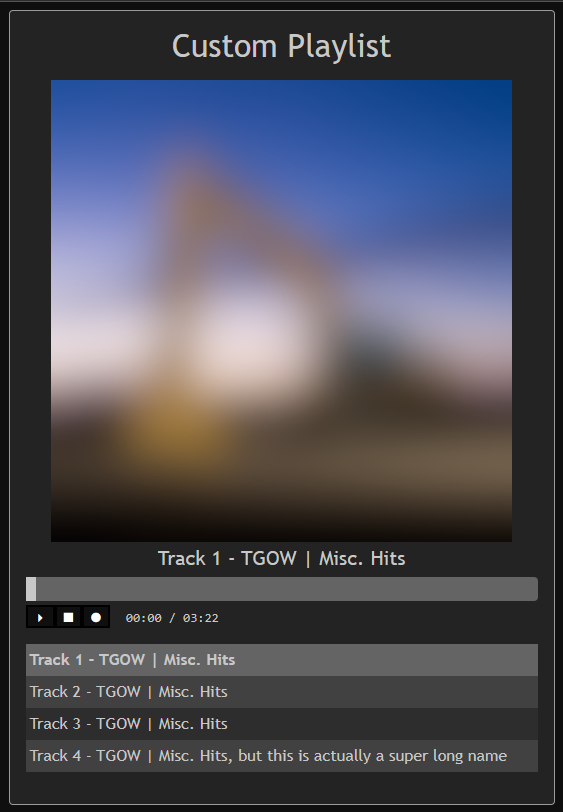

# Asayake2
Asayake2 is an open source "plug and play" audio player for your website. It has no external dependencies and uses 100% vanilla HTML/JS/CSS. This project runs entirely on the front-end and is fully agnostic to your back-end infrastructure. 



# Quick Start

Adding Asayake to an existing project is easy.

```html
<div id="asayake"></div>
<script src="../asayake.js"></script>
<script>
    const playlist = [
        {
            artist:'TGOW',
            albumName: 'Misc. Hits',
            trackName: 'Song 1',
            albumArt: 'albumArt/art1.jpg',
            url: 'music/track1.mp3'
        },
        {
            artist:'TGOW',
            albumName: 'Misc. Hits',
            trackName: 'Cool Song 2',
            albumArt: 'albumArt/art2.png',
            url: 'music/track2.mp3'
        }
    ];
    asa.init(playlist, 'Custom Playlist');
</script>
```
[More Examples](examples/)

---

# Playlist Definition
When initializing the player with the `init` method, you must provide a "playlist object". A "playlist object" is an array containing "playlist items".

Each playlist item must have the following properties:

```js
artist: 'The Artist Name',
albumName: 'The Album Name',
trackName: 'The Track Name',
albumArt: 'Album Art URL',
url: 'Audio File URL'
```

**Notes:** 
- Each property is a string type. 
- Omitting any of these properties is an error.
- There is no min/max image size but images should be uniform

---

# Theming
Theming can be handled via user CSS overrides. To do this simply add some CSS rules after your initialize Asayake. 

You can also use the `setColor` method mentioned in the Methods section. 

---

# Methods

## `init(playlist<object>, playlistTitle<string>)`
Initialize Asayake. All setup methods must be run before initialization. However, the `init` method can be run multiple times if needed. 

### Example:
```js
const playlist = [
    {
        artist:'TGOW',
        albumName: 'Misc. Hits',
        trackName: 'Song 1',
        albumArt: 'albumArt/art1.jpg',
        url: 'music/track1.mp3'
    },
    {
        artist:'TGOW',
        albumName: 'Misc. Hits',
        trackName: 'Cool Song 2',
        albumArt: 'albumArt/art2.png',
        url: 'music/track2.mp3'
    },
];
asa.init(playlist, 'Custom Playlist');
```

## `setColor(colorName<string>, colorValue<string>)`
Sets a given theme color. Must be run before `init()`.

Available colors (and defaults):

```js
bg: 'rgb(35,35,35)',
btnBg: 'rgb(15,15,15)',
btnBgHover: 'rgb(25,25,25)',
border: 'rgb(155,155,155)',
font: 'rgb(200,200,200)',
timelineBg: 'rgb(100,100,100)',
timelineInner: 'rgb(155,155,155)',
playhead: 'rgb(200,200,200)',
playlistItemBg: 'rgb(45,45,45)',
playlistItemBg2: 'rgb(65,65,65)',
playlistItemHover:'rgb(75,75,75)',
playlistItemActive:'rgb(100,100,100)',
```

### Example:
```js
// CSS color names
asa.setColor('background', 'black');
// RGB
asa.setColor('background', 'rgb(255,0,0)');
// HEX
asa.setColor('background', 'b6b1cf');
```

## `setWidth(newWidth<number>)`
Sets the player width. Must be run before `init()`.

### Example:
```js
asa.setWidth(512);
```

## `hideTitle()`
Hides the playlist title. Must be run before `init()`.

### Example:
```js
asa.hideTitle();
```

## `hideAlbumArt()`
Hides the album art. Must be run before `init()`.

### Example:
```js
asa.hideAlbumArt();
```